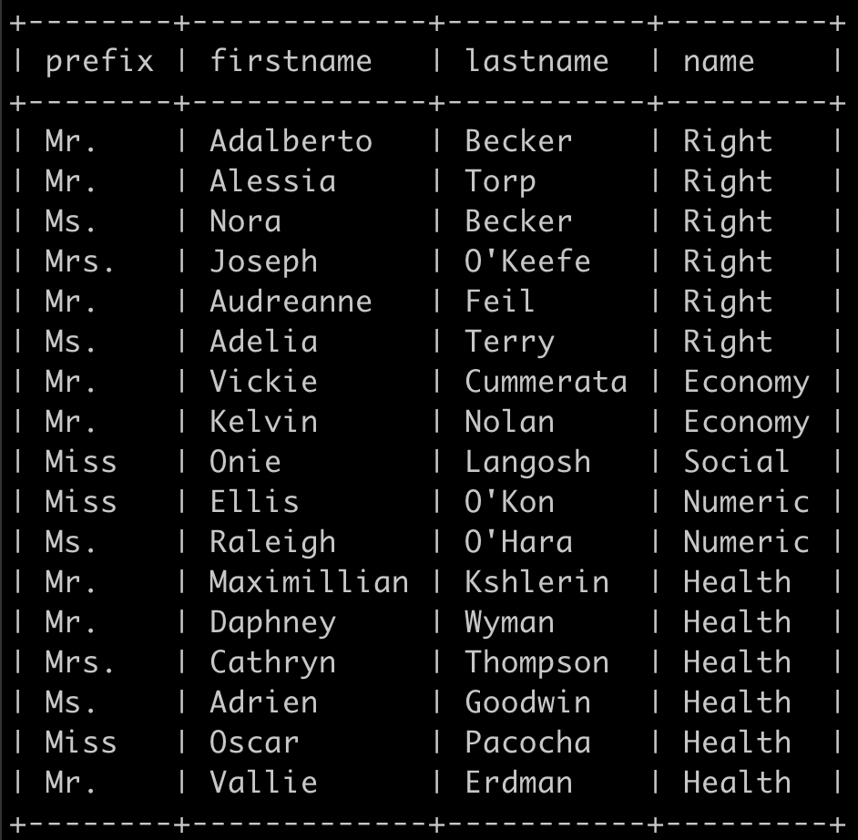

#SQL Dojo

## Create queries

### Query 1

Only `Mr.`, `Mrs.` and `Miss` prefix.

### Query 2

Only `Prof.` prefix order by alphabetic speciality.

### Query 3

Complete name where `firstname` contain `S` characters

### Query 4

number of persons per specialities.

